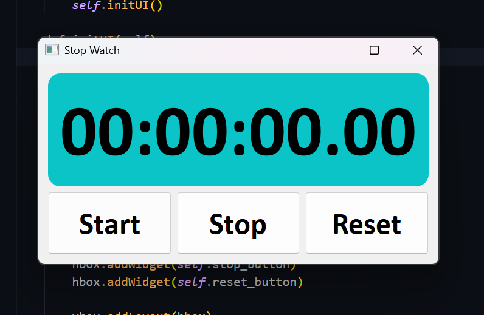

# ⏱️ GUI Stopwatch (Python + PyQt5)

A simple **Stopwatch Application** built using **Python** and **PyQt5**.  
This project demonstrates how to build a graphical stopwatch with basic controls..

---

## 🚀 Features
- ▶️ **Start** the stopwatch  
- ⏸️ **Stop** the stopwatch  
- 🔄 **Reset** the stopwatch  

---

## 🖥️ Tech Stack
- **Python 3** 🐍
- **PyQt5** 🎨 (for GUI)

---

## 📷 Preview
**  

---

## ⚙️ Installation & Usage

1. **Clone the repository**
   ```bash
   git clone https://github.com/cyb3rasad/GUI-stopwatch.git
